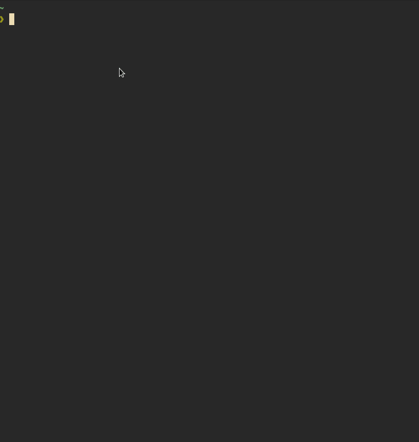

# trashy


*trashy* is a simple, fast, and featureful alternative to *rm* and *trash-cli* written in rust.

Quick links:

- [Usage](#usage)
- [Installation](#installation)

## Demo



## Features

- easy to use, just run `trash PATH`
- recursive by default, without having the issues
- beautiful output
    - colorized paths (similar to *fd*)
    - cool tables
- very fast, and faster than trash-cli (see [benchmarks](#benchmarks))
- much safer than `rm -rf`
- intuitive syntax and fine grained control
- uses the system trash on both linux and windows

## Usage

### Trash a path

```bash
$ trash first second third
```

This is just sugar for 

```bash
$ trash put first second third
```

### List items in the trash

```bash
$ trash list
```

### Restore or empty some files

```bash
$ trash restore first second
```
```bash
$ trash empty first second third
```

The `restore` and `empty` subcommands both take very similar arguments and flags.

By default the arguments for `restore` and `empty` are interpreted as regular expressions.
Use the `-m` option to interpret them differently.


### Restore or empty all files

```bash
$ trash restore --all
```

```bash
$ trash empty --all
```

## Integrations

### fzf

Restore with fzf
```bash
trash list | fzf --multi | awk '{$1=$1;print}' | rev | cut -d ' ' -f1 | rev | xargs trash restore --match=exact --force
```

Empty with fzf
```bash
trash list | fzf --multi | awk '{$1=$1;print}' | rev | cut -d ' ' -f1 | rev | xargs trash empty --match=exact --force
```

## Installation

### Using cargo

```
cargo install trashy
```

### From Github Releases

Download the binary from Github Releases and put it in your `$PATH`.

## Benchmarks

These benchmarks are run on the rust compiler source in the `compiler/` directory.
The directory has about 2000 files. The benchmarks are run using [hyperfine](https://github.com/sharkdp/hyperfine).

Running `put` on each file in the `compiler/` directory recursively.

```
hyperfine -M 1 'fd -t f --threads 1 -x trash-put'
```

```
Time (abs ≡):        65.849 s               [User: 54.383 s, System: 11.370 s]
```

Now with `trashy`

```
hyperfine -M 1 'fd -t f --threads 1 -x trash put'
```

```
Time (abs ≡):         4.822 s               [User: 2.014 s, System: 2.918 s]
```

`trashy` has practically zero startup time, while `trash-cli` has a large startup time because it is written in python. This difference in startup time causes massive speed differences when used in scripts. The benchmark shows that `trashy` is about 13 times faster!

Listing the previously trashed items

```
hyperfine 'trash-list'
```

```
Time (mean ± σ):     383.7 ms ±  10.5 ms    [User: 321.8 ms, System: 59.4 ms]
Range (min … max):   375.9 ms … 412.0 ms    10 runs
```


```
hyperfine 'trash list'
```

```
Time (mean ± σ):     178.3 ms ±   1.9 ms    [User: 135.7 ms, System: 40.4 ms]
Range (min … max):   175.6 ms … 181.0 ms    16 runs
```

`trashy` is faster by more than 2 times.


## License

Copyright (c) 2020 Brian Shu

*trashy* is distributed under the terms of both the MIT license and the Apache License 2.0.

See the [LICENSE-APACHE](LICENSE-APACHE) and [LICENSE-MIT](LICENSE-MIT)
